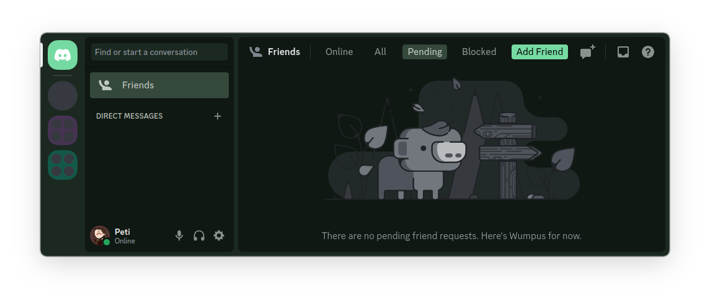

# DiscordMaterialGreen
###Make your discord green

## How to use:
You need to have [BetterDiscord](https://betterdiscord.app/) installed!

To install the theme, drag [MaterialGreen.theme.css](https://github.com/Peti253/DiscordMaterialGreen/blob/main/MaterialGreen.theme.css) into the themes folder.
if you don't know where the themes folder is, you can find it under `Settings` > `BetterDiscord` > `Themes`.

You can youse this Theme in combination with [DiscordRoundedCorners](https://github.com/Peti253/DiscordRoundedCorner/blob/main/RoundedCorners.theme.css) to get the following Result:

